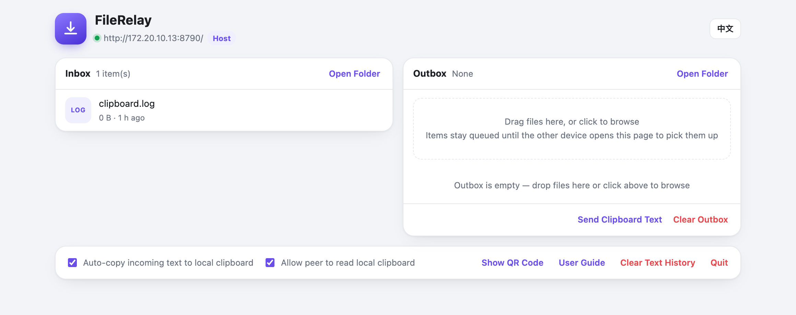
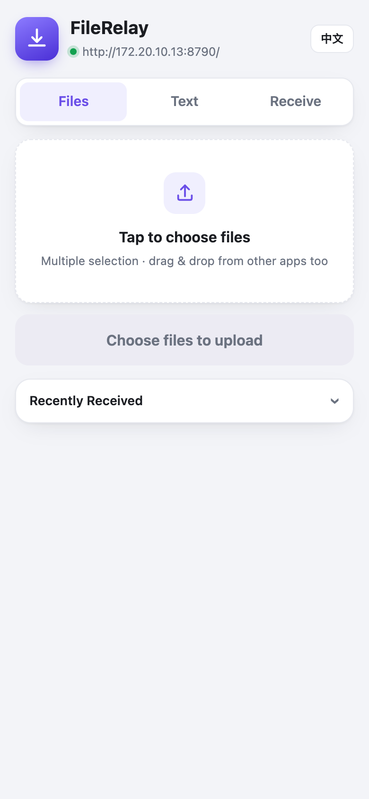

# FileRelay（文件互传）

A local-network file & text transfer bridge between your phone and your computer. **Zero install on the phone side**: scan the QR code in a browser and go — no app needed.

Pure Python standard library (zero third-party dependencies). The macOS app **bundles its own Python runtime** — the end user needs to install nothing. Windows / Linux run the same server via launcher scripts (they need Python 3.8+ on the system).



| | |
|---|---|
| 📖 User Guide (English) | [src/manual-en.html](src/manual-en.html) — also served at `/manual-en.html` once the app is running |
| 📖 使用手册（中文） | [src/使用手册.html](src/使用手册.html) — also served at `/doc` once the app is running |

The in-app UI supports **Chinese / English switching** (button at the top-right corner; the choice is remembered per browser).

## Download & Install

| Platform | Get it | Run |
|---|---|---|
| **macOS** | [FileRelay.app.zip](https://github.com/xiaoman-cmd/FileRelay/releases/download/v1.0/FileRelay.app.zip) (v1.0 release) | Unzip → move to `/Applications` → open (see the macOS notes below) |
| **Windows** | [Source code (zip)](https://github.com/xiaoman-cmd/FileRelay/archive/refs/heads/main.zip) | Unzip → double-click `scripts\start.bat` (needs [Python 3.8+](https://www.python.org/downloads/), tick *Add to PATH*) |
| **Linux** | [Source code (zip)](https://github.com/xiaoman-cmd/FileRelay/archive/refs/heads/main.zip) | Unzip → `./scripts/start.sh` (needs Python 3.8+) |

macOS is the only packaged build (it's the only version with the menu-bar shell). Windows / Linux intentionally run from source — the server is pure standard library, so "source" costs nothing extra. The guest side (any phone / computer) never installs anything.

### macOS — read this first (no window by design)

FileRelay on macOS is a **menu bar app** (`LSUIElement`). After you open it, **no window appears** — that's normal. Look at the **top-right of your screen (the status bar)**: a small icon shows up there. Click it to reveal the QR code, send/receive options, and settings. (First launch pops a one-time tip pointing you to that icon.)

If double-clicking "does nothing", it's almost always one of these two — in this order:

1. **Gatekeeper blocked it (most common).** A downloaded app is quarantined; the first launch is silently blocked. Fix — either:
   - **Right-click** the app → **Open** (approves it once and remembers), **or**
   - remove the quarantine flag in Terminal (run once):
     ```bash
     sudo xattr -dr com.apple.quarantine /Applications/FileRelay.app
     ```
   Then open it normally.
2. **(Legacy) Python 3.8+ not found.** The macOS app now **bundles its own Python**, so this should no longer happen. The launcher still auto-detects a system Python as a fallback (from `/usr/bin`, `/usr/local/bin` on Intel, `/opt/homebrew/bin` on Apple Silicon, `/opt/local/bin`, pyenv); if none is 3.8+ it shows a clear dialog instead of failing silently. If you ever build from source and strip the bundled runtime, install Python 3.8+ from [python.org](https://www.python.org/downloads/) or `brew install python`, then reopen.

The launcher writes its own diagnostics to `~/Library/Logs/FileRelay-launch.log` if anything still goes wrong.

Project website: **https://xiaoman-cmd.github.io/FileRelay/**

## Features

| Capability | Description |
|---|---|
| File transfer | Phone uploads files to the computer; computer drops files into the outbox for the phone — saved as-is, never renamed |
| Text transfer | Two-way text sharing and clipboard interop (independent switches per direction; the read direction is off by default) |
| Outbox | Async queue on the computer side: drop files in and they're sent; the receiver confirms pickup to clear them (kept 24h / max 200 items) |
| Zero-install guest | Phone browser + QR code; another computer's browser works as a guest too |
| Port fallback | Defaults to 8765, automatically scans forward (up to 20) if taken |
| Host console | On the host machine, opening the `127.0.0.1` address IS the console: send/receive panes, QR code, switches, quit service |
| Bilingual UI | Chinese / English toggle in the web UI; the guide opens in the matching language |



## Quick Start

### macOS app (menu bar)

```bash
./build.sh                # build FileRelay.app and install to /Applications
./build.sh --no-install   # build only, skip install
```

Icon rebuilding needs Pillow. If the system python3 lacks it, point to an interpreter that has it with `AT_PYTHON=/path/to/python3 ./build.sh`, or skip with `--no-icon`.

### Run from terminal (macOS / Linux / Windows)

```bash
./scripts/start.sh        # macOS / Linux, foreground, Ctrl+C to stop
scripts\start.bat         # Windows, closing the window stops it
```

Only Python 3.8+ is required; no pip dependencies. The startup banner prints the host console address and the LAN address.

### Let a guest connect

Menu bar icon → "Show QR Code" (or click "Show QR Code" in the console), then scan with the phone on the same Wi-Fi.

## Security Notes

- **Trusted local networks only.** The service is plain HTTP; do not expose the port to the internet. For cross-network use, bring your own tunnel (e.g. Tailscale).
- No token by default (anyone on the same Wi-Fi can upload / read the outbox). `export TOKEN=auto` before starting to enable one; the QR code then carries `?token=` automatically.
- Host-only actions ("Open Folder" / "Quit" / clipboard switches) only accept requests from `127.0.0.1`; LAN devices cannot invoke them.
- "Allow peer to read local clipboard" defaults to **off** (clipboards often contain passwords). Enable it in the console or menu bar when needed.

## Testing

```bash
python3 tests/selftest.py    # offline self-checks, isolated temp instance, never touches real data
```

## Project Layout

```
build.sh          macOS one-shot build (.app assembly / zip / install / health check)
src/              Build sources: server.py, index.html, user guides (zh/en), icon script, launcher
scripts/          start.sh (mac/Linux) / start.bat (Windows) terminal runners
tests/            selftest.py offline self-checks
docs/             UI screenshots
dist/             Build artifacts (not committed)
```

## License

[MIT](LICENSE)
